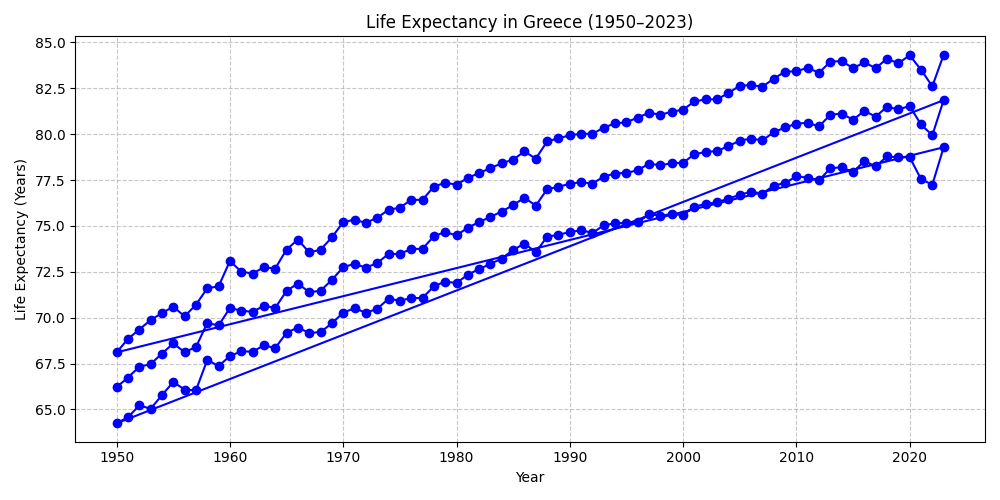
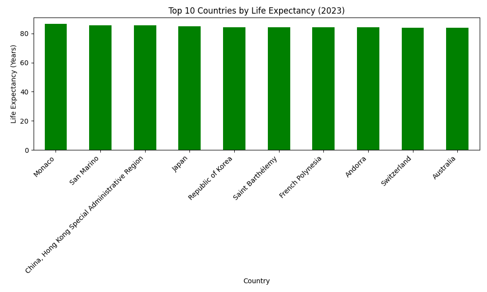

# Basic Python Data Analysis: Life Expectancy

Αυτό το mini project χρησιμοποιεί Python και pandas για να αναλύσει δεδομένα προσδόκιμου ζωής (Life Expectancy) ανά χώρα και έτος.

## Dataset
- Πηγή: [UNICEF Life Expectancy Dataset](https://data.humdata.org/dataset/unicef-dm-life-exp)
- Περιλαμβάνει δεδομένα από το 1950 έως 2023 για πολλές χώρες.

## Τεχνολογίες
- Python 3
- pandas
- matplotlib

## Βήματα ανάλυσης
1. Φόρτωση CSV δεδομένων
2. Καθαρισμός δεδομένων (επιλογή στηλών, μετονομασία)
3. Περιγραφικά στατιστικά
4. Top 10 χώρες ανά προσδόκιμο ζωής
5. Γραφήματα:
   - Εξέλιξη προσδόκιμου ζωής Ελλάδας (1950-2023)
   - Bar chart Top 10 χώρες 2023

## Screenshots
### Εξέλιξη Ελλάδας


### Top 10 χώρες 2023


## Χρήση
1. Κλωνοποίηση repo:
```bash
git clone https://github.com/username/basic-python-data-analysis.git

